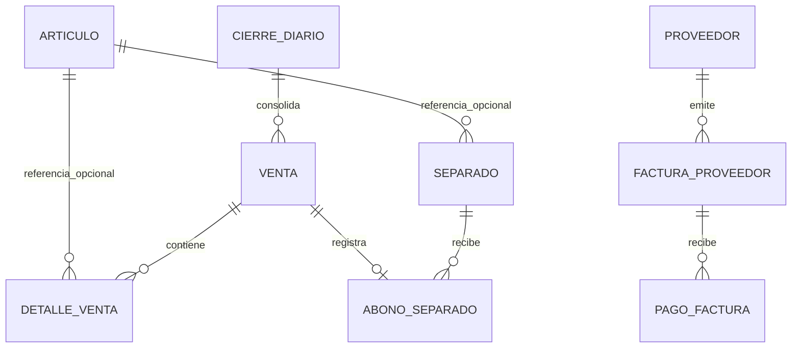

# Modelo inicial POS

## Objetivo de esta primera etapa

Construir una base de dominio que permita:

- registrar ventas manuales sin depender aun del catalogo de articulos
- guardar detalle de venta con estructura compatible para articulos futuros
- administrar separados con abonos parciales asociados a ventas
- consolidar cierres diarios persistidos
- administrar deuda con proveedores, facturas y pagos parciales
- almacenar soportes de factura y comprobantes de pago en Mongo usando GridFS

## Decision arquitectonica

Se propone un modelo hibrido:

- PostgreSQL para transacciones, integridad referencial y consultas de negocio
- MongoDB para metadata documental y GridFS para binarios grandes

Esto separa claramente:

- datos que requieren consistencia transaccional (`Venta`, `DetalleVenta`, `Separado`, `AbonoSeparado`, `FacturaProveedor`, `PagoFactura`, `CierreDiario`)
- archivos pesados que creceran con el tiempo (`DocumentoSoporte`)

## Relacion principal del dominio

## Reglas del modelo

### Ventas y detalle

- `Venta` puede existir sin `Articulo`
- `DetalleVenta.articuloId` es opcional
- cuando la venta sea manual, el valor digitado por el usuario se guarda en `Venta.montoManualInformado`
- la misma venta puede generar uno o mas `DetalleVenta`, incluso si hoy solo se usa una linea manual
- cuando entren articulos en el futuro, el mismo `DetalleVenta` seguira funcionando con `tipoDetalle=ARTICULO`

### Separados

- `Separado` representa el compromiso comercial del articulo apartado y no el movimiento de caja
- `AbonoSeparado` representa cada pago del separado y se asocia uno a uno con una `Venta`
- de esta forma el dinero del separado entra al cierre diario por `Venta`, sin duplicar movimientos
- no se crea aun modelo de clientes; el separado guarda referencias simples como `nombreCliente`, `documentoCliente` y `telefonoCliente`
- `Separado.articuloId` es opcional para no bloquear la etapa actual; tambien existe `descripcionArticulo`
- se deja persistido el parametro `montoMinimoInicial` con valor base de `20000 COP`
- cuando el saldo llegue a cero, el separado puede pasar a `PAGADO`; la entrega final queda representada aparte con `ENTREGADO`

### Cierres

- `CierreDiario` guarda un snapshot persistido del total del dia
- `Venta` puede quedar asociada a un `CierreDiario`
- el total del cierre sale de sumar ventas no anuladas, incluyendo ventas usadas como abonos de separados

### Proveedores, facturas y pagos

- `FacturaProveedor` guarda el valor total adeudado
- `PagoFactura` registra cada abono como un movimiento independiente
- `FacturaProveedor` mantiene `montoPagado` y `saldoPendiente`

### Imagenes y comprobantes

- `DocumentoSoporte` vive en Mongo
- el binario se plantea en GridFS
- la metadata referencia el dueno del archivo:
  - `FACTURA_PROVEEDOR`
  - `PAGO_FACTURA`

## Evolucion recomendada

1. Exponer casos de uso de ventas manuales y cierre diario.
2. Exponer apertura y abonos de separados usando `Venta` como movimiento monetario.
3. Agregar numeracion de ventas y estrategia de anulacion.
4. Incorporar articulos, impuestos y descuentos por linea.
5. Crear servicio de carga de archivos a GridFS.
6. Anadir pruebas de integracion con Postgres y Mongo via Testcontainers.
